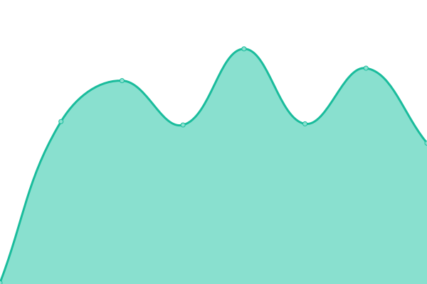

# [📈 Live Status](https://status.freispace.com): <!--live status--> **🟧 Partial outage**

This repository contains the open-source uptime monitor and status page for [freispace](https://status.freispace.com), powered by [Upptime](https://github.com/upptime/upptime).

With [Upptime](https://upptime.js.org), you can get your own unlimited and free uptime monitor and status page, powered entirely by a GitHub repository. We use [Issues](https://github.com/freispace/uptime-status/issues) as incident reports, [Actions](https://github.com/freispace/uptime-status/actions) as uptime monitors, and [Pages](https://status.freispace.com) for the status page.

<!--start: status pages-->
<!-- This summary is generated by Upptime (https://github.com/upptime/upptime) -->
<!-- Do not edit this manually, your changes will be overwritten -->
<!-- prettier-ignore -->
| URL | Status | History | Response Time | Uptime |
| --- | ------ | ------- | ------------- | ------ |
|  [Website](https://freispace.com/de/) | 🟩 Up | [website.yml](https://github.com/freispace/uptime-status/commits/HEAD/history/website.yml) | 

 855ms
     
 | 

<a href="https://status.freispace.com/history/website">100.00%</a>
    

|  [Application](https://app.freispace.com) | 🟩 Up | [application.yml](https://github.com/freispace/uptime-status/commits/HEAD/history/application.yml) | 

 1450ms
     
 | 

<a href="https://status.freispace.com/history/application">100.00%</a>
    

|  Staging application | 🟩 Up | [staging-application.yml](https://github.com/freispace/uptime-status/commits/HEAD/history/staging-application.yml) | 

 617ms
     
 | 

<a href="https://status.freispace.com/history/staging-application">99.79%</a>
    

|  Staging API | 🟥 Down | [staging-api.yml](https://github.com/freispace/uptime-status/commits/HEAD/history/staging-api.yml) | 

 214ms
     
 | 

<a href="https://status.freispace.com/history/staging-api">99.79%</a>
    

|  Staging database | 🟩 Up | [staging-database.yml](https://github.com/freispace/uptime-status/commits/HEAD/history/staging-database.yml) | 

 161ms
     
 | 

<a href="https://status.freispace.com/history/staging-database">99.79%</a>
    

|  Staging cache server | 🟩 Up | [staging-cache-server.yml](https://github.com/freispace/uptime-status/commits/HEAD/history/staging-cache-server.yml) | 

 158ms
     
 | 

<a href="https://status.freispace.com/history/staging-cache-server">99.79%</a>
    

|  Staging storage server | 🟩 Up | [staging-storage-server.yml](https://github.com/freispace/uptime-status/commits/HEAD/history/staging-storage-server.yml) | 

 1537ms
     
 | 

<a href="https://status.freispace.com/history/staging-storage-server">61.14%</a>
    

|  Realtime communication | 🟩 Up | [realtime-communication.yml](https://github.com/freispace/uptime-status/commits/HEAD/history/realtime-communication.yml) | 

 215ms
     
 | 

<a href="https://status.freispace.com/history/realtime-communication">99.80%</a>
    

|  E-mail service | 🟩 Up | [e-mail-service.yml](https://github.com/freispace/uptime-status/commits/HEAD/history/e-mail-service.yml) | 

 288ms
     
 | 

<a href="https://status.freispace.com/history/e-mail-service">100.00%</a>
    

<!--end: status pages-->

[**Visit our status website →**](https://status.freispace.com)

## 📄 License

- Powered by: [Upptime](https://github.com/upptime/upptime)
- Code: [MIT](./LICENSE) © [freispace](https://status.freispace.com)
- Data in the `./history` directory: [Open Database License](https://opendatacommons.org/licenses/odbl/1-0/)
